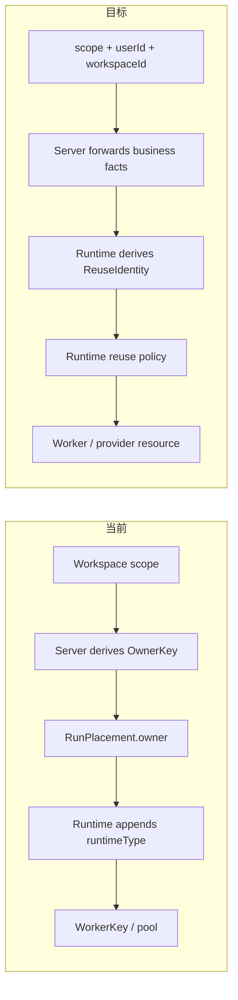

# Server / Runtime 隔离与复用边界重构

Status: ready-for-implementation

Date: 2026-07-19

Related:

- [`docs/design/server-runtime-worker-target-architecture.md`](../../docs/design/server-runtime-worker-target-architecture.md)
- [`research-plan.md`](research-plan.md)
- [`working.md`](working.md)

## 1. 结论

当前边界不正确。

用户选择并由 Server 持久化的是 `scope`：执行环境最多允许在一个 workspace 内共享，或在一个 user 内共享。Server 应把 `scope + userId + workspaceId` 作为业务事实交给 Runtime，不应再替 Runtime 构造 `OwnerKey`。

目标分工：

| 层 | 权威信息与决策 |
| --- | --- |
| Web / Server | 用户选择、Workspace 配置、`scope`、`runtimeType`、`runtimeHostId`、`userId`、`workspaceId`、业务生命周期 |
| Runtime Host | 从业务事实派生隔离主体；决定 worker 是否复用、复用索引、并发去重、回收与 fencing |
| Runtime Provider | 创建/停止/销毁具体执行资源；决定底层载体缓存实现，但不得突破 Runtime 给定的隔离边界 |

本次修改删除 Server↔Runtime 公共协议中的 `OwnerKey`、`WorkerKey` 和 `releaseOwner`。Runtime 内部可以保留等价的复用索引，但它不再是公共领域概念。

## 2. 术语

### 2.1 `scope`

`scope` 是最大共享边界，不是缓存命中指令，也不单独表示安全隔离强度。

- `workspace`：执行资源不得服务其他 workspace。
- `user`：执行资源可以服务同一 user 的多个 workspace，但不得跨 user。

`scope=user` 不代表 Server 命令 Runtime 必须复用现有 worker。Runtime 可以根据健康状态、压力、TTL 或 provider 能力选择复用或重建，只要不跨越 user 边界。

初次实施保留当前策略：同一 `(scope subject, runtimeType)` 同时最多一个活跃 worker。该规则下沉为 Runtime 内部策略，不再写入公共协议不变量。

### 2.2 Lifecycle target

Server 发给 Runtime 的资源收尾对象是业务主体：workspace 或 user。它不是 Runtime 的 cache key。

```ts
type RuntimeLifecycleTarget =
  | { type: "workspace"; workspaceId: string }
  | { type: "user"; userId: string };
```

### 2.3 Reuse identity

Runtime 内部根据 placement 唯一派生的结构化复用身份：

```ts
type ReuseIdentity = {
  scope: "workspace" | "user";
  subjectId: string;
  runtimeType: string;
};
```

该类型只存在于 `apps/runtime`，不从 `packages/shared` 导出。

## 3. 当前问题

### 3.1 Server 提前决定复用主体

当前 `RunLauncher` 根据 scope 构造：

```ts
scope === "user"
  ? userOwnerKey(userId)
  : workspaceOwnerKey(workspaceId);
```

随后 Runtime 只是执行：

```ts
workerKey(placement.owner, placement.runtimeType);
```

因此当前实际分工是“Server 决定复用桶，Runtime 执行复用机制”，不是目标中的“Server 给事实，Runtime 决定复用”。

### 3.2 同一请求存在双重真相

`RunPlacement` 同时包含 `owner`、`userId` 和 `workspaceId`。Runtime SDK 又根据 `scope + userId/workspaceId` 独立计算一次 `ownerId`。

wire 校验只检查字段格式，不检查：

- `owner=user:A` 是否满足 `userId === A`；
- `owner=workspace:B` 是否满足 `workspaceId === B`。

矛盾请求可导致 worker pool、挂载规划和 provider 资源身份使用不同来源。

### 3.3 Server 构造后又反解析 owner

Server 为记录 run 状态事件，需要从 `placement.owner` 反解析回 `scope`。这说明公共 owner 编码没有提供新事实，只增加了耦合。

### 3.4 生命周期协议泄漏 Runtime 内部模型

`releaseOwner` 要求 Server 构造 Runtime 复用键。重连对账又从 admin `WorkerSnapshot` 合成 owner 列表，让业务逻辑依赖了本应只供诊断的形状。

### 3.5 当前 release 不是完成屏障

`submitRun` 会先 reserve session，再异步准备 RunConfig，之后才把 starting worker 放入 pool。`releaseOwner` 只枚举 pool，不能命中尚未入池的 reservation/acquisition。

结果是：release 已返回成功，先前受理的 submit 仍可能继续创建 worker。

### 3.6 user 停用/删除清理不完整

当前 user listener 只释放 `user-scope` worker；同一用户的 `workspace-scope` worker 和 active run 不处理。现有测试明确锁定了这个行为，但事件注释和既有目标设计都声称 user 禁用/删除需要清理该用户名下执行资源。

本设计定案：`disabled` 与 `deleted` 都撤销继续执行的权限。实现必须覆盖该用户两类 scope。

## 4. 当前与目标调用链



## 5. 目标公共契约

### 5.1 Run placement

```ts
export type RunPlacement = {
  scope: "workspace" | "user";
  runtimeType: RuntimeType;
  runtimeHostId: string;
  workspaceId: string;
  userId: string;
  username: string;
  workspacePath: string;
};
```

规则：

- 删除 `owner`。
- `scope` 始终存在；native 也是 `workspace`，不能再用 `scope === undefined` 暗示 native。
- Server 仍负责校验 Workspace 归属、持久化配置和选择目标 Host。
- Runtime 必须按当前 capability 再校验 `(runtimeType, scope)`，防 registered Host 能力漂移。
- Runtime SDK 保留 user-scope workspacePath 必须位于 user root 下的路径校验。

### 5.2 Lifecycle

```ts
export type ReleaseRuntimeResourcesInput = {
  runtimeHostId: string;
  target: RuntimeLifecycleTarget;
  /** user disable/re-enable 等可逆生命周期使用；不可逆删除也应单调。 */
  lifecycleVersion?: number;
};

export interface RuntimeHostResourceLifecycle {
  releaseResources(input: ReleaseRuntimeResourcesInput): Promise<void>;
}
```

语义：

- workspace target：取消/fence 该 workspace 已受理的 submission 和 run；只释放 workspace-scope worker。user-scope 共享 worker继续服务同用户其他 workspace。
- user target：取消/fence 该 user 的全部 submission 和 run；释放该用户的 user-scope worker以及所有 workspace-scope worker。
- 成功 ACK 是完成屏障：命令开始前已受理的匹配 reservation、acquisition 和 ready worker 都已取消或完成回滚。
- 重复调用幂等；旧 lifecycle version 不得影响更新版本下创建的资源。

如果实现阶段不能在同一批引入可靠 lifecycle version，至少必须完成不可逆 workspace/user delete 的 fencing；user disable/re-enable 必须保留阻塞测试或单独任务，不能默认为已解决。

### 5.3 Reconciliation

不要再从 admin `WorkerSnapshot` 合成业务 owner。

新增最小业务对账投影：

```ts
export type RuntimeSubjectRef = {
  runtimeHostId: string;
  scope: "workspace" | "user";
  subjectId: string;
  userId: string;
};

export interface RuntimeHostResourceReconciliation {
  listResourceSubjects(runtimeHostId: string): Promise<RuntimeSubjectRef[]>;
  releaseResources(input: ReleaseRuntimeResourcesInput): Promise<void>;
}
```

要求：

- 查询失败必须显式失败，不能折叠为空列表。
- Host 重连后先完成 run reconcile 与 resource subject reconcile，再接收新的 submit；若暂时不能做全 Host gate，至少对待确认 subject 保持 fence。
- workspace 存活校验必须同时考虑其 user 是否仍 active。
- 失败要进入可重试状态，不能只寄希望于“下次再重连”。

### 5.4 Diagnostics 与 admin stop

```ts
export type StopWorkerInput = {
  runtimeHostId: string;
  workerId: string;
};

export type WorkerSnapshot = {
  runtimeHostId: string;
  workerId: string;
  runtimeType: string;
  isolation: {
    scope: "workspace" | "user";
    subjectId: string;
  };
  userId: string;
  runIds: string[];
  runtimeInstanceId: string;
  status: "starting" | "ready";
  lastSeenAt: string;
};
```

- 删除 `workerKey`、`ownerId`。
- admin 使用 `(runtimeHostId, workerId)` 精确停止 worker。
- snapshot 只表达现场事实，不能作为业务生命周期命令输入。
- registered daemon 退出不再 `listWorkers → stopWorker(workerKey)`，改用 Runtime 内部幂等 `shutdown()` / `drainWorkers()`。

## 6. Runtime 内部设计

### 6.1 唯一派生点

```ts
function deriveReuseIdentity(placement: RunPlacement): ReuseIdentity {
  return {
    scope: placement.scope,
    subjectId:
      placement.scope === "user"
        ? placement.userId
        : placement.workspaceId,
    runtimeType: placement.runtimeType,
  };
}
```

一次 submit 只派生一次，以下消费者共享同一个结构化结果：

- reuse lookup 与并发 acquire 去重；
- `WorkerEntry`；
- provider launch context；
- worker env / logging metadata；
- diagnostics；
- release/reconcile 匹配。

### 6.2 Worker pool

推荐拆成两个概念索引：

```ts
workersById: Map<string, WorkerEntry>;
reuseIndex: Map<string, string | Set<string>>;
runIndex: Map<string, string>;
```

- `workersById` 是 stop、fence 和现场控制的权威索引。
- `reuseIndex` 是可替换策略索引；初期可以一 identity 对一个 workerId。
- `WorkerEntry` 保存结构化 isolation、`userId`、相关 workspace/run，而不是从字符串 key 反解析。
- 序列化只用于 Map key，不能成为协议；不要用可歧义的 `scope:id#runtimeType` 直接拼接，优先数组 JSON 或长度前缀编码。

### 6.3 Reservation 与 release fencing

RunSession 在 reserve 时必须保存：

- `userId`；
- `workspaceId`；
- `scope`；
- `runtimeType`；
- lifecycle version（若启用）。

release 必须：

1. 建立 target fence，阻止旧 submission 继续推进；
2. 标记并取消匹配 reservation；
3. 取消并等待匹配 acquisition settle；
4. 移除 ready worker，并等待 provider release/rollback 到达定义终点；
5. 最后返回 ACK。

新 submit 只有在业务主体有效且 lifecycle version 不旧于 fence 时才能进入。

## 7. Runtime SDK 与 Provider

### 7.1 删除 provider owner 语义

从以下类型删除 `ownerId`：

- `RuntimeSpec`；
- `RuntimeLaunchContext`；
- `RuntimeInstanceRef`；
- `SandboxPlacement`。

Runtime 向 provider 提供：

```ts
type RuntimeLaunchContext = {
  runtimeType: string;
  workerId: string;
  runId: string;
  workspaceId: string;
  isolation: { scope: "workspace" | "user"; subjectId: string };
  resourceName: string;
  placement: RuntimeSpec;
  workerEnv: Record<string, string>;
  expectedRuntimeInstanceId?: string | null;
};
```

`resourceName` 由 Runtime 生成，对 provider 不透明。它必须避免：

- userId 与 workspaceId 字面相同；
- 不同 runtimeType；
- 特殊字符 sanitize 后相同；
- 超长 ID 截断后相同；
- 将来同一复用身份允许多个 worker。

建议使用带 scope/runtimeType 的稳定哈希，并把原始结构化字段分别写入 labels，不把 lossy sanitize 结果当唯一标识。

### 7.2 Provider 改动

- Docker：容器名使用 `resourceName`；labels 分别记录 runtimeType、scope、subjectId、userId、workerId。
- OpenSandbox：metadata 与日志名使用同一 resourceName/isolation 结构。
- Native：child channel 按 `workerId` 索引，不再按裸 ownerId；stop/release 使用 workerId。
- `AGEWORK_WORKER_OWNER_ID` 改为 isolation/reuse 中性命名，或在 worker 不需要该信息时直接删除。同步 runner env allowlist 与日志字段。

## 8. Server 生命周期编排

### 8.1 Workspace 删除

1. Server 标记 workspace 不再接受新 run。
2. cancel 该 workspace 的 active runs。
3. 调用 `releaseResources(workspace target)`。
4. Runtime fence 尚未进入 pool 的 submission/acquisition。
5. workspace-scope worker 被释放；user-scope worker保留。

事件 listener 的 best-effort fire-and-forget 不能作为唯一可靠路径。删除成功后未完成的释放需要 durable retry，或由重连 desired-state reconcile 保证最终完成。

### 8.2 User disabled / deleted

本设计定义为 execution revoke：

1. 阻止该 user 新建 run。
2. cancel 该 user 所有 active runs。
3. 对相关 Host 调用 `releaseResources(user target)`。
4. Runtime 释放 user-scope 与该用户所有 workspace-scope worker。
5. disabled 后若允许 re-enable，使用 lifecycle version 防迟到 disable 命令误停新资源。

### 8.3 Host 重连

1. 建立 tunnel 与 epoch fencing。
2. 对账 active runs。
3. 获取结构化 resource subjects。
4. Server 依据 Workspace/User 当前状态下发 release。
5. 对账成功后 Host 才进入 ready-for-submit。

业务对账不能调用 `listWorkers()`，也不能把单 Host 查询错误解释为“没有资源”。

## 9. Wire 升级

这是 breaking change，涉及：

- `host.submitRun`；
- `host.releaseOwner` → `host.releaseResources`；
- `host.stopWorker`；
- `host.listWorkers`；
- 新的 resource reconciliation RPC。

默认迁移策略：`RUNTIME_HOST_TUNNEL_PROTOCOL_VERSION` 从 2 升到 3，Server 与 registered Runtime 同批升级。v2 连接按现有严格版本检查明确拒绝，builtin 同进程不涉及滚动兼容。

只有明确提出不停机滚动升级要求时才做 v2/v3 双栈。双栈 owner 适配只能位于 transport adapter，Server 核心与业务模块一律使用新结构，升级完成后删除兼容代码。

## 10. 修改范围

### 10.1 Shared protocol

- `packages/shared/src/protocol/runtime-host.ts`
- `packages/shared/src/protocol/index.ts`
- `packages/shared/src/protocol/host-tunnel.ts`
- `packages/shared/src/protocol/wire.ts`
- 对应 protocol / wire specs

### 10.2 Server

- `apps/server/src/run/launch/run.launcher.ts` 与 spec
- `apps/server/src/run/run.service.ts`：增加按 user 停止 active runs 的用例入口
- `apps/server/src/run/workspace/run-workspace.listener.ts` 与 spec
- `apps/server/src/runtime-host/runtime-host.types.ts`
- `apps/server/src/runtime-host/contract/runtime-host.adapter.ts` 与 spec
- `apps/server/src/runtime-host/contract/tunnel-runtime-host.ts`
- `apps/server/src/runtime-host/gateway/host-tunnel.handler.ts` 与 spec
- `apps/server/src/runtime-host/runtime-host.service.ts` 与 spec
- `apps/server/src/runtime-host/dto/stop-worker.dto.ts`
- `apps/server/src/runtime-host/admin/admin-worker.controller.ts` 与 spec
- `apps/server/src/workspace/owner-release/`：重命名为 resource reconciliation 语义
- `apps/server/src/user/owner-release/`：重命名并覆盖两类 scope
- 相关 module specs / DI token mocks

### 10.3 Runtime Host

- `apps/runtime/src/host/runtime-host.ts` 与 spec
- `apps/runtime/src/host/worker-pool.ts` 与 spec
- `apps/runtime/src/host/run-session-registry.ts` 与 spec
- `apps/runtime/src/host/run-config.ts`
- `apps/runtime/src/registered/tunnel-client.ts` 与 spec
- `apps/runtime/src/registered/main.ts`
- `apps/runtime/src/providers/native/native-runtime.provider.ts` 与 spec
- worker logging / runner env allowlist 与相关 specs

### 10.4 Runtime SDK / providers

- `packages/runtime-sdk/src/types.ts`
- `packages/runtime-sdk/src/runtime-spec.ts`
- `packages/runtime-sdk/src/sandbox-launch.ts`
- `packages/runtime-docker/src/docker-runtime.provider.ts`
- `packages/runtime-opensandbox/src/opensandbox-runtime.provider.ts`
- 上述文件对应 specs

### 10.5 Web admin

- `apps/web/src/api/runtime-hosts.ts`
- `apps/web/src/hooks/use-runtime-host.ts`
- admin worker panel / run detail 中的 workerKey、owner 展示与停止参数

### 10.6 文档

- 更新 `docs/design/server-runtime-worker-target-architecture.md`，推翻“owner 由 Server 算好传入”的旧契约。
- 更新 `docs/architecture/worker-rpc-protocol.md`。
- 更新 `docs/config.md` 中 worker owner env 的旧名称。
- 在 Runtime Host ADR 中记录“scope 是最大共享边界，reuse 是 Runtime 策略”；历史 ADR 保留正文但加 superseded 指针。
- 更新 `docs/README.md` 索引（若新增 ADR 不需要顶层索引，可只更新所属 context index）。

## 11. 实施顺序

### Task 1：文档与内部模型

- 先提交 ADR 和本设计定案。
- 在 Runtime 引入结构化 `ReuseIdentity`、`workersById` 与独立 `reuseIndex`。
- 临时从旧 `placement.owner` 适配到新内部模型，外部行为不变。

验收：Runtime 内部不再从字符串 WorkerKey 反解析业务字段；现有复用行为保持。

### Task 2：SDK / Provider

- `ownerId` 改为 isolation + opaque resourceName。
- 修正 Docker 名称、labels、OpenSandbox metadata、Native channel 索引。

验收：不同 scope/runtimeType 和 sanitize 冲突输入不会命名碰撞或误停。

### Task 3：Shared v3 协议与 Runtime daemon

- 新 `RunPlacement`、release、reconciliation、stop、snapshot 类型。
- 更新 wire decoder、RPC method、tunnel client。
- 增加 Runtime release fencing 与内部 shutdown API。

验收：v3 wire 坏输入被拒绝；release ACK 满足完成屏障。

### Task 4：Server 切换

- launcher 直接下发 scope 与业务 ID。
- lifecycle listeners 切 business target。
- user disable/delete 覆盖两类 scope并先 cancel。
- 重连改用 resource reconciliation，不消费 admin snapshot。

验收：Server 业务代码不再 import/构造/解析 OwnerKey 或 WorkerKey。

### Task 5：Admin / Web / 清理

- stop 改 host+workerId。
- 更新展示字段。
- 删除 legacy owner helpers、v2 owner RPC 和过时测试 fixture。
- 更新权威文档。

验收：在 `apps/` 与 `packages/` 的 Runtime 相关代码中，除 RBAC/普通英文“owner”语义外，不再存在旧 Runtime OwnerKey 模型。

任务依赖顺序为 `1 → 2 → 3 → 4 → 5`。若多人并行，Task 1 的内部模型与 Task 2 的 provider 类型有重叠，必须先拆清公共类型提交，不能在独立分支各自修改 `packages/runtime-sdk/src/types.ts`。

## 12. 必须覆盖的测试

### Placement / wire

- 缺少 scope、非法 scope、空 userId/workspaceId、非法 runtimeType 被拒绝。
- 协议中不存在可与业务 ID 矛盾的 owner 字段。
- Runtime 使用当前 capability 校验 scope。

### Reuse boundary

- workspace scope：同 workspace 按当前策略复用；不同 workspace 不共享。
- user scope：同 user 的两个 workspace 可复用；不同 user 不共享。
- 同字面 userId/workspaceId 不碰撞。
- 同 subject 不同 runtimeType 不碰撞。
- 特殊字符、sanitize 等价、超长 subject ID 不碰撞。

### Lifecycle / races

- RunConfig 准备期间 release。
- provider start 期间 release。
- ready worker release。
- release ACK 后旧 submit 不得创建资源。
- 重复 release 幂等。
- workspace 删除 user-scope：清该 workspace runs，但保留共享 worker。
- user disabled/deleted：先 cancel，再释放两类 scope。
- re-enable 后迟到的旧 disable release 不得误停新 worker。

### Reconnection

- Host 离线期间 workspace 删除，重连后补清。
- Host 离线期间 user disabled/deleted，重连后两类 scope 都补清。
- 对账失败不当作空列表，并进入重试。
- 对账完成前不接受失效主体的新 submit。
- business reconciliation 不调用 admin `listWorkers`。

### Diagnostics / shutdown

- admin 以 host+workerId 只停止目标 worker。
- 未知 workerId 幂等空操作。
- registered tunnel 路由正确。
- SIGINT/SIGTERM 只执行一次 shutdown，所有 worker 收口，重复信号不并发清理。

### Provider

- Docker resourceName 与结构化 labels 正确。
- Native 多 worker channel 按 workerId 隔离，停止一个不影响另一个。
- OpenSandbox metadata 与 SDK input 一致。
- 启动失败 rollback、heartbeat fence、worker HTTP 鉴权现有行为回归。

## 13. 非目标

- 不改变用户创建 Workspace 时的 UI 选项。
- 不开放 Workspace 创建后的 scope/runtimeType/Host 修改。
- 不引入 Worker 数据库表。
- 不把 provider 缓存策略上移到 Server。
- 不改变 business RBAC 中“资源 owner”的定义；本设计只处理 Runtime worker 复用模型。
- 不在本任务中承诺 v2/v3 不停机滚动升级；默认同步升级。

## 14. 风险与实现护栏

| 优先级 | 风险 | 护栏 |
| --- | --- | --- |
| P0 | release ACK 后旧 acquisition 重新创建资源 | reserve 时记录 placement；subject fence；等待 acquisition settle |
| P0 | user disabled 后 workspace-scope worker继续执行 | user target 匹配该 user 的全部 WorkerEntry 与 RunSession |
| P0 | v2/v3 registered daemon 不兼容 | 升 protocol version；发布说明要求同步升级；不静默降级 |
| P1 | Docker/native 以裸 ownerId 索引导致碰撞或误停 | opaque resourceName；native 按 workerId 索引 |
| P1 | 重连对账失败被当成无资源 | 显式错误结果与 retry；ready gate |
| P1 | 为兼容继续把 legacy owner 泄漏回业务层 | legacy translation 只能存在于 transport adapter |
| P2 | UI/日志/配置继续使用 owner 旧术语 | grep 验收并更新文档/env/展示 |

## 15. 被本设计推翻的旧结论

`docs/design/server-runtime-worker-target-architecture.md` 中以下内容需要更新：

- `OwnerKey` 作为 Server↔Runtime 公共契约。
- “owner 键、runtimeType 由 Server 算好传入契约”。
- `WorkerKey` 作为 admin stop 输入。
- `releaseOwner(ownerKey)` 作为业务生命周期动词。
- 业务 reconciliation 可以消费 admin `WorkerSnapshot` 的隐含实现。

保留的结论：

- Workspace 持久化 scope/runtimeType/runtimeHostId。
- Host 不解引用 Server 业务数据。
- Runtime Host 独占 worker/runner/provider 生命周期。
- 同一物理 Host 支持多个 runtimeType。
- builtin 与 registered 使用同一逻辑契约，只有 transport 不同。

## 16. 完成定义

- Server 只下发 scope 与业务身份事实，不构造 Runtime 复用键。
- Runtime 是 ReuseIdentity 和复用策略的唯一权威。
- lifecycle 命令使用 workspace/user target，并覆盖 reservation、acquisition、ready worker。
- user disabled/deleted 覆盖两类 scope。
- admin、重连对账和 daemon shutdown 都不依赖 WorkerKey。
- shared public protocol 不再导出 OwnerKey/WorkerKey 或相关 parser/builder。
- Runtime 相关旧 owner 术语清理完成；RBAC owner 不受影响。
- 精准单测、相关 package typecheck 通过；不要求自动 build、lint 或浏览器测试。
