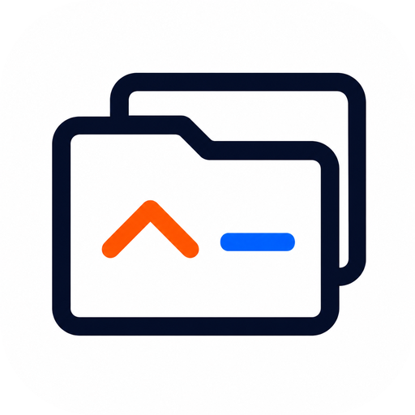
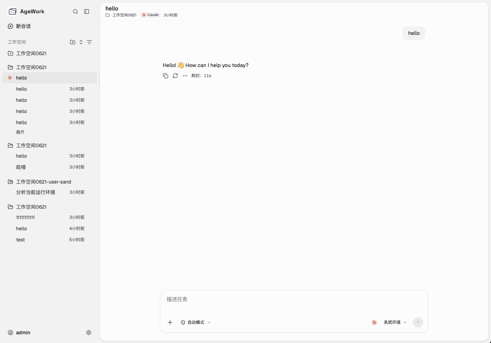
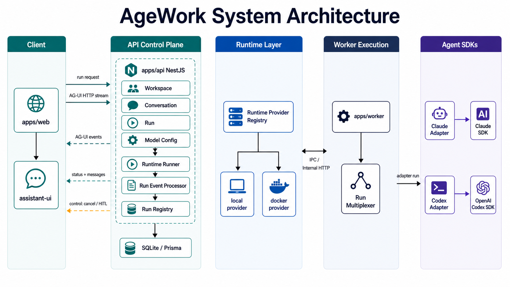

<div align="center">
  
  <h1>AgeWork</h1>
  <p><strong>Local-first, self-hosted AI Agent workbench for real development workflows.</strong></p>
  <p>把 Claude、Codex 等 AI Agent 放进一个可部署、可管理、可追踪的工作系统。</p>
  <p>
    
    =20" />
    
    
  </p>
</div>



## What is AgeWork?

AgeWork 是一个面向 AI 编程工作流的本地化多 Agent 工作台。它不是单纯的聊天界面，也不是把多个 Agent 简单聚合到一个面板里，而是把 **项目工作区、Agent 会话、运行环境、模型配置、执行日志和历史记录** 放进同一个可控系统。

你可以把它理解为：

> 一个开源、可私有化部署、可扩展的 Agent Workbench / Agent Control Plane。

AgeWork 当前重点服务两类场景：

- **个人开发者**：在自己的电脑或服务器上运行 AI Agent，统一管理项目、会话、配置和执行记录。
- **团队和组织**：在内网或私有环境中部署统一的 Agent 工作台，沉淀 workspace、run history、审计日志和团队配置。

## Why AgeWork?

AI 编程工具正在从「聊天助手」变成「能执行任务的 Agent」。但在真实开发场景里，仅有聊天窗口通常不够：

- 项目上下文需要被持续管理，而不是每次重新描述。
- Agent 执行过程需要可追踪、可中断、可恢复。
- 代码、密钥、运行环境和日志需要留在自己的机器、内网或私有云。
- 团队需要统一配置模型、权限、运行策略和审计记录。
- 不同 Agent 的能力需要接入同一套 workspace、UI 和事件协议。

AgeWork 的目标就是把这些能力组织成一个可以长期运行的工作系统。

## Features

| 能力 | 说明 |
| --- | --- |
| 多 Agent 接入 | 通过 adapter 接入 Claude、Codex 等 Agent，并统一转换为前后端可消费的事件流。 |
| 项目化工作区 | 以 workspace 组织代码目录、会话历史、任务输入和执行记录。 |
| 会话与运行历史 | 保留 conversation、run history、工具调用、状态变化和诊断信息。 |
| Local / Sandbox Runtime | 支持本机运行，也可以接入 sandbox runtime 执行高隔离任务。 |
| OpenSandbox 支持 | 可启动本地 OpenSandbox Server，并使用 AgeWork worker 镜像执行 Agent 任务。 |
| 本地优先数据控制 | 默认使用本地 SQLite，数据、配置和日志由当前 AgeWork 实例管理。 |
| 可选登录验证 | 开发模式可免登录；生产部署默认启用登录验证，并在首次访问时设置固定 `admin` 管理员密码。 |
| Web + API + Worker + Desktop | 同一仓库维护 React Web、NestJS API、Agent Worker 和 Electron 桌面壳。 |

## Quick start

### Requirements

- Node.js `>=20`
- pnpm `10.33.4`
- Docker：仅在使用 sandbox、OpenSandbox 或构建 worker 镜像时需要

### Start with the interactive guide

```bash
pnpm boot
```

### Or start manually

```bash
pnpm init:dev
pnpm dev
```

默认开发地址：

- Web: http://localhost:5173
- API: http://localhost:3000/api/v1

进入系统后，在「设置 -> Agent 配置」添加 Claude、Codex 等 Agent 所需的 API Key，然后回到首页创建项目即可开始使用。

> 生产模式或手动启用登录验证时，第一次打开页面会引导你设置固定 `admin` 管理员密码。

## Common commands

| 命令 | 说明 |
| --- | --- |
| `pnpm boot` | 交互式初始化向导 |
| `pnpm init:dev` | 初始化开发环境 |
| `pnpm init:prod` | 初始化生产环境 |
| `pnpm dev` | 同时启动 API 和 Web |
| `pnpm dev:api` | 只启动后端服务 |
| `pnpm dev:web` | 只启动前端服务 |
| `pnpm typecheck` | 全仓类型检查 |
| `pnpm test:api` | 后端单元测试 |
| `pnpm test:web` | 前端单元测试 |
| `pnpm db:push` | 同步数据库 schema |
| `pnpm db:studio` | 打开 Prisma Studio |
| `pnpm app:deploy` | 构建并启动生产服务 |
| `pnpm kill-port <port>` | 清理指定端口 |

## Architecture

AgeWork 采用 monorepo 组织，核心链路如下：

```text
Web UI
  -> API Server
    -> Runtime Manager
      -> Local Worker / Sandbox Worker
        -> Agent Adapter
          -> Claude / Codex / other Agent backends
```

其中：

- **Web UI**：工作区、会话、任务输入、消息流和管理页面。
- **API Server**：用户、配置、workspace、conversation、run、runtime 和事件聚合。
- **Runtime Manager**：根据 workspace 配置选择 local 或 sandbox runtime。
- **Worker**：负责启动 Agent adapter、转发任务、回传事件和运行状态。
- **Agent Adapter**：把不同 Agent 的 SDK / CLI / 协议事件转换为 AgeWork 统一事件流。

系统架构图：



## Tech stack

- Monorepo: pnpm workspace + Turborepo
- Web: React 19, Vite, Tailwind CSS v4, TanStack Router, TanStack Query, assistant-ui
- API: NestJS 11, Prisma, SQLite / PostgreSQL driver adapter
- Worker / Adapters: Claude Agent SDK, Codex app-server (JSON-RPC), AG-UI
- Desktop: Electron
- Test: Vitest, Playwright

## Repository structure

```text
.
├── apps
│   ├── api       # NestJS API、Prisma schema、服务端模块
│   ├── web       # React + Vite 前端
│   ├── worker    # Agent worker
│   └── desktop   # Electron 桌面壳
├── packages
│   ├── adapters  # Claude、Codex 等 Agent adapter
│   ├── shared    # 前后端共享类型、协议类型、API 类型
│   └── react-ag-ui
├── e2e           # Playwright E2E 测试
├── infra         # OpenSandbox 等基础设施配置
└── scripts       # 初始化、端口清理、worker 构建等脚本
```

## Documentation

- [使用与部署指南](docs/usage.md)：启动、开发、部署、配置、Runtime / Sandbox、OpenSandbox、桌面端。
- [配置管理](docs/config.md)：环境变量、DB 系统设置、模型 Provider 配置。
- [OpenSandbox 本地开发环境](docs/opensandbox-setup.md)：OpenSandbox 启动、排错和常用命令。
- [AG-UI 接入说明](docs/ag-ui.md)：前后端 Agent 事件协议和项目内使用方式。
- [产品定位与方向](docs/product-positioning-and-direction.md)：AgeWork 的定位、边界和阶段性路线。

## Roadmap

AgeWork 仍处于快速开发阶段。当前优先级：

- 稳定 local workspace、conversation、run history 和事件流体验。
- 打磨 Claude / Codex 等核心 Agent 的深度接入，而不是浅层堆叠大量 Agent。
- 完善 sandbox runtime、OpenSandbox 集成和 worker 镜像构建链路。
- 强化团队部署所需的权限、审计、配置治理和 API-first 能力。
- 持续演进 Web、API、Worker、Desktop 的统一部署体验。

## Contributing

AgeWork 还在早期阶段，欢迎通过 Issue / Discussion 参与：

- 反馈安装、启动、部署问题。
- 提出新的 Agent adapter 或 runtime 需求。
- 讨论 workspace、sandbox、权限、审计、团队协作等产品设计。
- 提交文档、测试、bugfix 或小型功能 PR。

在提交较大的功能前，建议先开 Issue 讨论设计边界，避免和当前架构方向冲突。

## Status

AgeWork is under active development. APIs, runtime abstractions and deployment scripts may change before a stable release.
