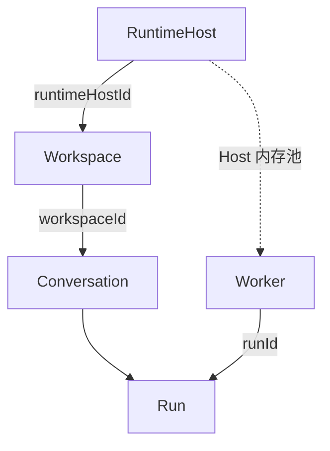

# Runtime Host · Workspace · Worker 数据模型

> 状态：已被 [Server · Runtime Host · Worker 目标架构](./server-runtime-worker-target-architecture.md) 取代。
> 本文只保留当前数据模型结论，避免旧的 Worker 落库方案继续被当成实施依据。

## 当前结论

- `RuntimeHost` 一行代表一台执行机器；一台 Host 通过能力矩阵声明多个 `runtimeType`，每种能力分别声明支持的 `scope`。
- `Workspace` 固化 `runtimeHostId`、`runtimeType`、`scope`。其中 `runtimeType` 是执行方式，`scope` 是 Worker 复用范围，两者不是同一维度。
- `scope` 对所有执行方式都有真实语义：`native` 只支持 `workspace`；`docker` 和 `opensandbox` 支持 `user`、`workspace`。
- `Worker` 是 Runtime Host 内存中的瞬态执行实体，不写入 server 数据库。池键为 `${owner}#${runtimeType}`，其中 `owner` 已编码为 `workspace:<id>` 或 `user:<id>`。
- `Run` 只保存业务状态投影和 `runtimeType`，不保存 worker、进程、容器或 sandbox 实例标识。

## 关系

完整的不变量、契约与迁移状态以目标架构文档为准。
