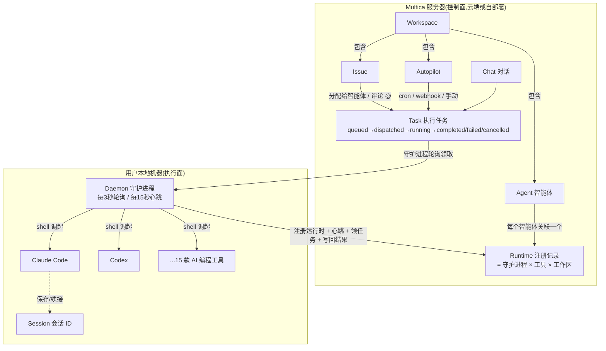

# Multica 守护进程 / 运行时 / 任务模型研究

> 基于 multica.ai 官方中文文档(2026-07-14 抓取):三篇主文档 [daemon-runtimes](https://multica.ai/docs/zh/daemon-runtimes)、[install-agent-runtime](https://multica.ai/docs/zh/install-agent-runtime)、[tasks](https://multica.ai/docs/zh/tasks),辅以同站 [docs 总览](https://multica.ai/docs/zh)、[how-multica-works](https://multica.ai/docs/zh/how-multica-works)、[agents](https://multica.ai/docs/zh/agents)、[workspaces](https://multica.ai/docs/zh/workspaces)、[autopilots](https://multica.ai/docs/zh/autopilots)。全部论断来自官方一手文档,未采用二手转述。
>
> 目标:理解 Multica 的「控制面(服务器)+ 本地执行面(守护进程/运行时)」模型,为与 AgeWork 的 server/runtime/worker 架构对比讨论做铺垫。

---

## 1. Multica 是什么

一句话定位(官方原文):**"一个任务协作平台——人类和 AI 智能体在同一个工作区里共同工作。"**[^index]

关键差异化:智能体任务**不在 Multica 服务器上执行**,而是由用户自己机器上的守护进程调用本地安装的 AI 编程工具(Claude Code、Codex、Cursor 等 15 款)完成——"你的 API 密钥、工具链、代码目录都留在本地,Multica 服务器看不到"。[^daemon][^how]

[^index]: https://multica.ai/docs/zh
[^daemon]: https://multica.ai/docs/zh/daemon-runtimes
[^how]: https://multica.ai/docs/zh/how-multica-works

---

## 2. 概念模型

### 2.1 核心概念定义

| 概念 | 定义 | 职责 | 来源 |
|---|---|---|---|
| **Workspace(工作区)** | "一群人一起协作的独立空间",隔离边界:issue、成员、评论、智能体配置都限定在工作区内 | 多租户隔离单元;有 slug 与 issue 前缀(如 `MUL-1`) | [workspaces](https://multica.ai/docs/zh/workspaces) |
| **Agent(智能体)** | 工作区里的"一等公民成员"——和人一样能被分配 issue、发评论、被 @、当 project 负责人 | 身份/协作层实体;**每个智能体关联一个运行时**;有 workspace/private 两种可见性;可归档 | [agents](https://multica.ai/docs/zh/agents) |
| **Daemon(守护进程)** | 跑在用户自己机器上的常驻小程序,调用本地安装的 AI 编程工具,不在 Multica 服务器运行 | 探测本机 PATH 上的 15 款 AI 工具→向服务器注册运行时→每 3 秒轮询领任务、每 15 秒发心跳 | [daemon-runtimes](https://multica.ai/docs/zh/daemon-runtimes) |
| **Runtime(运行时)** | "守护进程与一款 AI 编程工具的组合";更精确地:一台机器上的守护进程 × 一款工具 × 一个工作区 = 一条运行时 | 任务的实际执行载体标识;服务器侧的注册记录,有在线/失联状态 | [daemon-runtimes](https://multica.ai/docs/zh/daemon-runtimes)、[install-agent-runtime](https://multica.ai/docs/zh/install-agent-runtime) |
| **Task(执行任务)** | "智能体每一次工作的单位",带明确状态机、超时和重试规则 | 服务器入队→守护进程领取→AI 工具执行→结果写回服务器 | [tasks](https://multica.ai/docs/zh/tasks) |
| **Issue** | 工作区内的工作项(`<前缀>-<数字>` 编号),可分配给人或智能体;分配给智能体即触发任务 | 协作层工作载体;任务失败(且未重试成功)会把 issue 状态从 `in_progress` 退回 `todo` | [tasks](https://multica.ai/docs/zh/tasks)、[workspaces](https://multica.ai/docs/zh/workspaces) |
| **Session(会话)** | AI 工具侧的对话会话,任务在开始(首条系统消息)和结束时各保存一次会话 ID | 支撑续接:自动重试继承会话 ID,手动重跑始终新建会话;各工具续接机制不同(`--resume` / ACP `session/load` / `thread/resume` 等) | [tasks](https://multica.ai/docs/zh/tasks)、[install-agent-runtime](https://multica.ai/docs/zh/install-agent-runtime) |
| **Autopilot** | 时间/事件驱动的自动化:"让智能体按 cron 定时自己开工,或在 webhook 到来时被触发" | 第四种任务来源;两种执行模式(先建 issue / 直跑 task);失败不自动重试、不发通知 | [autopilots](https://multica.ai/docs/zh/autopilots) |
| **Runtime Profile(自定义运行时配置)** | 工作区级配置:让协议兼容的自研 CLI 以自定义命令注册为运行时 | 配置属于整个工作区、同步到所有守护进程;每台机器只在本机找到对应命令时才注册 | [daemon-runtimes](https://multica.ai/docs/zh/daemon-runtimes) |

### 2.2 概念关系图



要点:

- **一个守护进程对应多个运行时**:一台 MacBook 装 Claude Code + Codex、加入两个工作区 = 4 条运行时;同一守护进程在同一工作区同一工具仅一条运行时,重启不产生重复记录。[^daemon]
- **Agent 与 Runtime 解耦但绑定**:Agent 是协作层身份(可被 @、可当负责人),Runtime 是执行层载体;"每个智能体关联一个运行时",工具离线则智能体无法工作。[^agents]
- **Task 是唯一的执行原语**:四种入口(分配 issue、评论 @、聊天、Autopilot)全部收敛为 task,共享同一状态机/超时/重试规则。[^tasks]

[^agents]: https://multica.ai/docs/zh/agents
[^tasks]: https://multica.ai/docs/zh/tasks

---

## 3. 架构设计

### 3.1 三组件分布式架构

官方 [how-multica-works](https://multica.ai/docs/zh/how-multica-works) 划分三个组件:

```
┌────────────────────────────────────────────────────┐
│ Multica 服务器(Cloud 或 Docker Compose 自部署)      │
│  · 数据库:工作区 / issue / 成员 / 任务队列          │
│  · WebSocket hub 推送实时更新                       │
│  · "不执行任何智能体任务"                           │
└───────────────▲────────────────────────────────────┘
                │ 轮询领任务(3s)/ 心跳(15s)/ 结果写回
┌───────────────┴────────────────────────────────────┐
│ Daemon(用户机器上的常驻进程)                        │
│  · 启动:读登录凭证 → 探测 PATH 上 15 款工具         │
│    → 注册运行时 → 开始轮询 + 心跳                    │
│  · 为每个任务创建隔离工作目录,shell 调起 AI 工具     │
└───────────────┬────────────────────────────────────┘
                │ 按命令名 shell 调用(argv 风格)
┌───────────────▼────────────────────────────────────┐
│ AI 编程工具(15 款:Claude Code / Codex / Cursor …)  │
│  · API key、代码目录、授权全部留在本地               │
└────────────────────────────────────────────────────┘
```

关键设计点:

1. **纯 pull 模型**:守护进程主动每 3 秒轮询领任务、每 15 秒发心跳;服务器从不反向连入本地机器。[^daemon][^how]
2. **服务器只做控制面**:数据库 + 任务队列 + WebSocket 推送,明确声明"不执行任何智能体任务"。[^how]
3. **隐私边界即架构边界**:API 密钥、工具链、代码目录只在本地;Cloud 与自部署"都不改变这一点"。[^how]
4. **云端运行时是补充而非默认**:云端执行"即将开放"(等待名单制),当前唯一执行面就是本地守护进程。[^daemon]

### 3.2 Agent 运行时如何被"托管"

Multica 不打包、不下发、不管理 AI 工具本身——工具由用户自己按各厂商方式安装(npm / 安装脚本 / 桌面端附带),守护进程只负责**发现和调用**:[^install]

- 发现:按固定命令名扫 PATH(如 `claude`、`codex`、`cursor-agent`、`kiro-cli`),`which <工具名>` 能找到即可注册。
- 调用:按命令名 shell 调起;自定义运行时用 argv 风格命令(支持引号/转义,**不支持**管道、重定向、`&&`、`$VAR` 展开——需要 shell 行为时用 wrapper 脚本)。[^daemon]
- 协议适配:各工具接入方式不一——Codex 走 JSON-RPC 2.0、Kiro/Kimi/Qoder/Trae 走 ACP-over-stdio、Antigravity 只有纯文本 stdout 无结构化事件流;MCP 配置注入方式也各异(`mcp_config` 字段 / `OPENCODE_CONFIG_CONTENT` 环境变量 / ACP `mcpServers` / `--mcp-config` 参数)。[^install]
- 自定义扩展:协议兼容的团队自研 CLI 可通过 Runtime Profile(`multica runtime profile create --protocol-family codex --command-name agent`)注册;配置存工作区、同步到所有守护进程,但每台机器只在本机有该命令时才真正注册运行时。[^daemon]

[^install]: https://multica.ai/docs/zh/install-agent-runtime

### 3.3 存活判定与故障恢复

全部基于**心跳超时 + 启动自愈 + 服务器兜底扫描**三层:[^daemon]

| 机制 | 参数 | 行为 |
|---|---|---|
| 心跳 | 每 15 秒 | 守护进程 → 服务器 |
| 失联判定 | 超 45 秒无心跳(漏 3 次) | 运行时标记失联;其上运行中的任务标记失败(原因 `runtime_offline`),可重试来源自动重新排队 |
| 恢复 | 再次心跳 | 即刻回到在线,运行时记录保留 |
| 自动清理 | 失联且无关联智能体超 7 天 | 运行时记录自动删除 |
| 守护进程崩溃 | 下次启动时 | 守护进程主动告诉服务器把停在 dispatched/running 的任务标记失败(原因 `runtime_recovery`),自动重排队 |
| 服务器兜底 | 每 30 秒扫描 | 超 45 秒无心跳的运行时统一标记失联、任务回收 |

并发限额两层取更紧者:守护进程层默认 20 并发(`MULTICA_DAEMON_MAX_CONCURRENT_TASKS`)、智能体层默认 6 并发(智能体配置里改)。任务卡在 `queued` 不 `dispatched` 通常表示某层打满。[^daemon]

---

## 4. 安装与生命周期

### 4.1 守护进程生命周期(CLI)

```bash
multica daemon start      # 默认后台;--foreground 前台
multica daemon stop
multica daemon restart
multica daemon status
multica daemon logs -f
```

桌面应用内置守护进程,启动时自动拉起。[^daemon]

### 4.2 安装一个 Agent 运行时

官方定义:运行时 = "在你机器上的守护进程,加上守护进程在 PATH 里扫到的某一款 AI 编程工具"。安装流程(以 Claude Code 为例):[^install]

1. 前提:守护进程已运行(`multica daemon start` 或桌面端)。
2. 按厂商方式安装工具:npm 包 `@anthropic-ai/claude-code`(Node 18+),完成工具自身登录(CLI 登录流程或 `ANTHROPIC_API_KEY`)。
3. 验证 `which claude` 有输出;新装完需开新终端或 `multica daemon restart` 让 PATH 生效。
4. 检查 Multica Runtimes 页面出现 `(工作区 × 工具)` 行;onboarding 的"连接运行时"步骤会轮询,几秒内扫到。

**没有 Multica 侧的"升级"概念**:工具升级完全走各厂商自己的渠道(npm 等),Multica 只在守护进程重启/PATH 刷新后重新探测。故障排除三板斧:`multica daemon status` → `multica daemon logs -f` → Runtimes 页面确认在线;典型问题是"守护进程用旧 PATH 启动"(重启解决)和"工具自身登录过期/版本不对"(终端单独跑 `--version` 测试)。[^install]

### 4.3 自定义运行时(Runtime Profile)

```bash
multica runtime profile list
multica runtime profile create --display-name "Composer" --protocol-family codex --command-name agent
multica runtime profile update <profile-id> --command-name agent
multica runtime profile set-path <profile-id> --path /abs/path/to/agent   # 桌面端找不到命令时
multica runtime profile delete <profile-id>
```

仅工作区 owner/admin 可创建;基础协议需是已支持协议之一。[^daemon]

---

## 5. Task 模型

### 5.1 触发方式(四种,全部收敛为 task)

1. 分配 issue 给智能体(最常见);
2. 评论里 @ 提及智能体(不改 issue 状态的快速触发);
3. 聊天消息(独立对话,不绑 issue);
4. Autopilot:cron 定时(5 字段、分钟粒度、IANA 时区、30 秒扫描延迟)/ webhook(唯一 URL 即凭证,支持幂等投递与事件过滤)/ 手动触发(`multica autopilot trigger <id>`)。[^tasks][^autopilots]

Autopilot 有两种执行模式:`create_issue`(默认,先建 issue 再走标准分配流程,工作落在看板上)与 `run_only`(直接入队 task,只在运行历史可见)。[^autopilots]

[^autopilots]: https://multica.ai/docs/zh/autopilots

### 5.2 状态机

```
queued ──守护进程领取──▶ dispatched ──工具启动──▶ running ──▶ completed
   │                        │                      │
   └── cancelled(用户取消)   └──────── failed(出错/超时;可重试原因自动重排队)
```

| 状态 | 含义 |
|---|---|
| `queued` | 刚创建,等守护进程领取 |
| `dispatched` | 守护进程领走,正在启动 AI 工具 |
| `running` | AI 工具执行中 |
| `completed` / `failed` / `cancelled` | 终态 |

执行位置:服务器入队 → 守护进程领取 → AI 编程工具执行 → **结果由守护进程写回服务器**,WebSocket 推送实时进度。[^tasks][^how]

### 5.3 超时(服务器粗粒度 + 本地细粒度双层)

服务器每 30 秒扫描:派发后 5 分钟不启动 → 超时;运行超 2.5 小时 → 超时;均自动重试。本地守护进程另有更细的活动检测:`MULTICA_AGENT_TIMEOUT`(墙钟,默认 0 = 无上限)、`MULTICA_AGENT_IDLE_WATCHDOG`(空闲看门狗,默认 30 分钟)、`MULTICA_AGENT_TOOL_WATCHDOG`(工具看门狗,默认 2 小时)。失败原因区分 `timeout`(墙钟)与 `idle_watchdog`(活动检测)。[^tasks]

### 5.4 重试与重跑

**自动重试**:仅可重试原因(`runtime_offline` / `runtime_recovery` / `timeout`)触发;最多 2 次(1 原 + 1 重试);仅对 issue 和聊天任务生效;**Autopilot 任务不自动重试**(设计上避免与周期重叠导致重复执行,失败只留 `failed` 记录、退回 issue 状态、发收件箱通知——纯 Autopilot 直跑则连通知也不发)。`agent_error`(AI 工具自身报错:API 错误、超额度、内部 bug)不重试。[^tasks][^autopilots]

**手动重跑**:`multica issue rerun <issue-id>`(API `POST /api/issues/{id}/rerun`);跑 issue 当前的智能体分配人;自动取消目标 agent 在该 issue 上的 queued/running 任务;**创建全新执行任务、不继承会话 ID**;尝试计数重置、无上限。[^tasks]

### 5.5 会话续接

任务保存会话 ID 两次:任务开始(AI 工具返回首条系统消息)和任务结束。**自动重试继承会话 ID,手动重跑始终新建会话**。续接能力依赖各工具:Claude Code/Codex/Cursor/Copilot 等 11 款支持(机制各异:`--resume`、`thread/resume`、ACP `session/load`、Pi 甚至用磁盘会话文件路径当 resume id),Gemini 不支持。[^tasks][^install]

---

## 6. 设计取舍与亮点

1. **执行面完全外置,控制面零执行**。服务器只有队列 + 状态 + 推送;所有敏感物(密钥/代码/工具授权)天然留在用户侧,隐私边界不靠权限控制而靠架构切割。代价:执行可观测性受限于守护进程上报。[^how]
2. **纯 pull + 心跳,无反向连接**。3 秒轮询领任务、15 秒心跳,服务器不需要打洞进用户内网;实时性用轮询频率换,一致性用"崩溃后启动自愈 + 服务器 30 秒兜底扫描"双保险。[^daemon]
3. **不托管 agent 二进制**。Multica 对 AI 工具零打包零分发:发现(PATH 扫描)与调用(argv 命令)之外一概不管,升级/登录/配额全归各厂商。上手成本转嫁给用户,但彻底避开了 15 款工具 × 多平台的分发矩阵。[^install]
4. **Runtime 是三元组注册记录,不是进程**。运行时 = 守护进程 × 工具 × 工作区,是服务器侧的逻辑行;真正常驻的只有一个 daemon 进程,每个任务临时 spawn 工具进程并配"隔离工作目录"。[^daemon][^how]
5. **失败原因即重试策略**。`runtime_offline` / `runtime_recovery` / `timeout` 可重试,`agent_error` 不可;Autopilot 一律不自动重试。用失败原因枚举直接编码重试语义,规则极简可预测。[^tasks]
6. **Agent(身份)与 Runtime(载体)分离**。智能体是协作层一等成员(可被 @、当负责人、有可见性配置),运行时是执行载体;一对一绑定但概念独立,协作模型不感知执行细节。[^agents]
7. **会话续接作为一等能力矩阵**。逐工具枚举 resume 机制并在重试(继承会话)与重跑(新会话)间做出明确语义区分。[^tasks]

---

## 7. 与自托管 agent 执行面架构(AgeWork server/runtime/worker)对比时值得讨论的问题清单

> AgeWork 模型:server(NestJS 控制面)+ runtime(执行面宿主/管理)+ worker(常驻 agent 执行进程,worker-manager → worker → RunnerManager → runner)。以下仅列问题,不做结论。

1. **推 vs 拉**:Multica 是守护进程 3 秒轮询 + 15 秒心跳的纯 pull;AgeWork 是 server 主动派发/长连接。pull 模型换来的"服务器不进用户网络"对 AgeWork 的远程 worker 场景有没有价值?轮询延迟(最坏 3 秒起步)可否接受?
2. **常驻粒度**:Multica 只有一个常驻 daemon,per-task spawn 工具进程;AgeWork 是常驻 worker(agent 进程本身常驻)。常驻 agent 进程带来的会话保持/预热收益,与 per-task 隔离工作目录的干净性,边界在哪?
3. **失败原因驱动重试**:Multica 用 `runtime_offline` / `runtime_recovery` / `timeout` / `agent_error` 枚举直接决定可否重试(且上限 2 次、定时任务不重试)。AgeWork 的 run 失败分类是否也值得收敛成"原因即策略"的封闭枚举?
4. **崩溃自愈的归属**:Multica 由 daemon 重启时**主动上报**回收 + 服务器 30 秒扫描兜底(45 秒心跳超时)。AgeWork 的 worker 崩溃/失联后 run 终态化由谁负责、有没有等价的双层兜底?
5. **超时双层化**:服务器粗粒度(5 分钟启动超时 / 2.5 小时运行超时)+ 本地细粒度(空闲看门狗 30 分钟 / 工具看门狗 2 小时)。AgeWork 目前的超时/看门狗是否只有单层?空闲检测(有无输出活动)是否值得引入?
6. **Runtime 身份模型**:Multica 的运行时是 (daemon × 工具 × 工作区) 三元组注册行,重启幂等不产生重复记录、失联 7 天自动清理。对比 AgeWork 的 WorkerRegistry 行 + startToken 复用,注册幂等与陈旧记录回收策略是否等价?
7. **并发限额分层**:Multica 在 daemon 层(20)和 agent 层(6)各设上限、取更紧者,并把"卡 queued"作为诊断信号。AgeWork 的并发控制在哪一层、是否有可观测的"为什么没被调度"信号?
8. **会话续接语义**:Multica 明确"自动重试继承会话、手动重跑新建会话"。AgeWork 的 resume/重试链路里,会话继承与否是否有同样明确的语义边界?
9. **不托管 vs 托管 agent 二进制**:Multica 零分发,靠 PATH 发现 + 各厂商自升级;AgeWork(managed-local embed npm install 等)走托管路线。两种取舍下的版本漂移、升级窗口、故障归因分别怎么处理?
10. **协作层与执行层分离**:Multica 的 Agent(可 @、可当负责人的一等成员)与 Runtime 完全分层。AgeWork 的 agent 概念目前更贴执行层,是否需要一个独立于执行载体的"协作身份"层?

---

## 附:来源 URL 汇总

- https://multica.ai/docs/zh — 产品定位、快速开始
- https://multica.ai/docs/zh/how-multica-works — 三组件架构、任务生命周期六阶段
- https://multica.ai/docs/zh/daemon-runtimes — 守护进程命令、运行时定义、心跳/失联/并发/崩溃恢复、Runtime Profile
- https://multica.ai/docs/zh/install-agent-runtime — 15 款工具安装/发现/协议/续接矩阵、故障排除
- https://multica.ai/docs/zh/tasks — task 状态机、超时、重试/重跑、会话续接
- https://multica.ai/docs/zh/agents — 智能体一等成员模型、与运行时绑定关系
- https://multica.ai/docs/zh/workspaces — 工作区隔离模型、issue 编号
- https://multica.ai/docs/zh/autopilots — cron/webhook/手动触发、两种执行模式、不自动重试的设计理由
